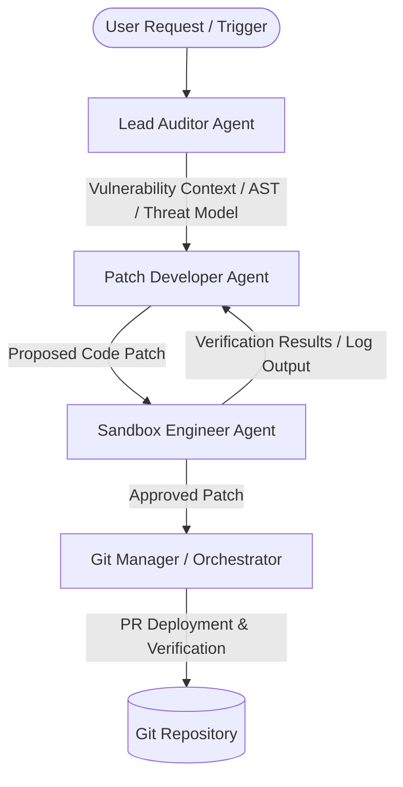

# AegisOps Internal Agent Ecosystem

This document establishes the official operational blueprint, communication paths, and constraints of the runtime sub-agents powering the AegisOps.dev autonomous remediation engine.

## 1. Agent Architecture & Responsibilities

### Lead Auditor Agent
*   **Role**: Primary ingestion, threat modeling, and vulnerability scanning engine.
*   **Responsibilities**:
    *   Ingest the target codebase using AST parsing and semantic search (via MCP `repo-parser`).
    *   Locate security flaws, zero-days, and unoptimized configurations (via MCP `vuln-scanner`).
    *   Synthesize a structured vulnerability footprint (CWE, CVSS-style assessment, and reproduction steps).
*   **Constraints**:
    *   Strictly read-only workspace access.
    *   Must not write or modify source code files.

### Patch Developer Agent
*   **Role**: Automated code remediation and patch generation.
*   **Responsibilities**:
    *   Ingest the vulnerability footprint generated by the Lead Auditor.
    *   Generate a minimal, surgical code patch target to address the root security flaw.
    *   Refactor code in compliance with the `/src/tools/README.md` and `defensive-python` skill rules.
*   **Constraints**:
    *   Cannot directly push to remote repository branches or run code locally outside of the sandboxed test environment.
    *   Must optimize for minimal diff footprints to reduce human review friction.

### Sandbox Engineer Agent
*   **Role**: Isolated environment provisioning, exploit reproduction, and patch verification.
*   **Responsibilities**:
    *   Provision short-lived Docker sandboxes mimicking the target production environment.
    *   Inject the original vulnerable code + patch, and execute validation scripts/unit tests.
    *   Capture and report output logs, execution telemetry, and verification results back to the orchestrator.
*   **Constraints**:
    *   Forbidden from accessing host machine resources or networks outside Alibaba Cloud Sandbox VPC boundaries.
    *   Must destroy the sandbox environment immediately upon task completion.

---

## 2. Communication Protocol & Channels
*   **Structured Inter-Agent Messages**: Agents must communicate utilizing structured JSON payloads containing standard headers: `sender`, `recipient`, `task_id`, `state`, and `payload`.
*   **Consensus Gates**: Before any patch moves to deployment, the Patch Developer and Sandbox Engineer must achieve a consensus handshake:
    1.  *Developer* submits patch definition.
    2.  *Sandbox* deploys, runs test suite, and returns `VERIFIED` or `FAILED` status.
    3.  If `FAILED`, the loop retries up to 3 times before raising an alert to the Lead Auditor/Orchestrator.
