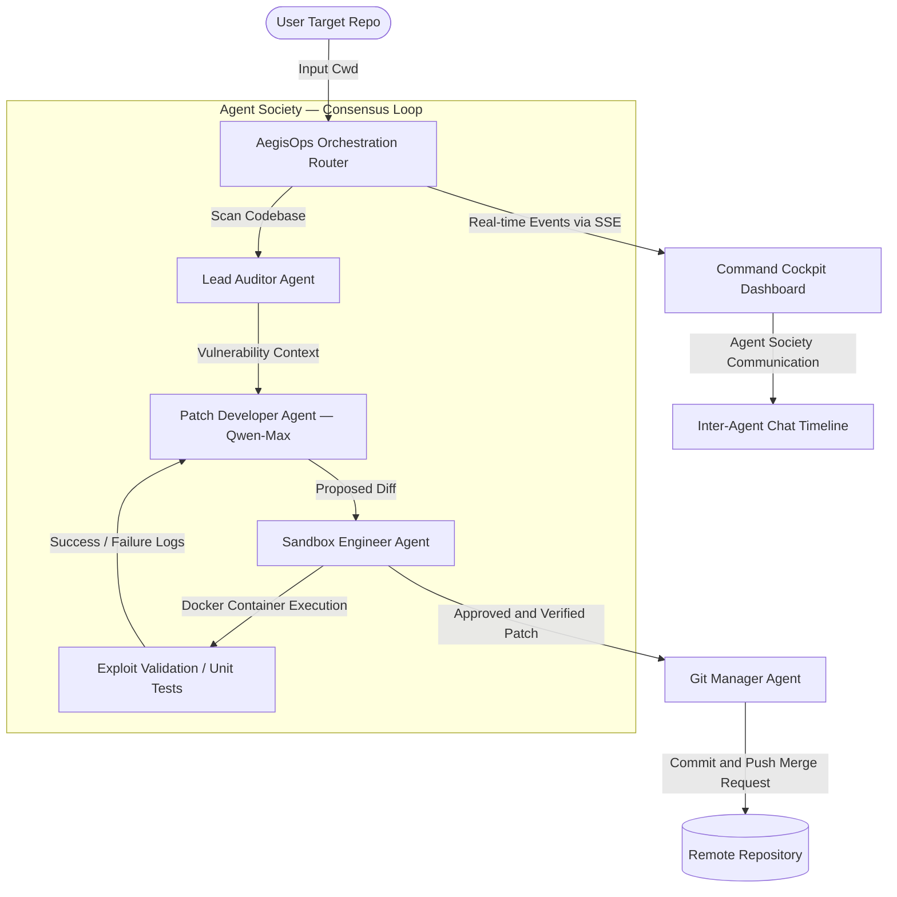

# AegisOps.dev — Autonomous Code Remediation powered by Qwen Cloud

<div align="center">

**An autonomous, multi-agent cybersecurity engine that scans codebases for vulnerabilities, generates surgical patches with Qwen-Max, validates them in isolated Docker sandboxes, and commits verified fixes — all through real-time agent-to-agent consensus.**

[](https://www.alibabacloud.com/help/en/model-studio/)
[](https://python.org)
[](LICENSE)
[](https://qwencloud-hackathon.devpost.com/)

</div>

---

## 🎯 Problem Statement

Security vulnerabilities in software repositories are discovered faster than developers can fix them. Manual code audits are slow, expensive, and error-prone. Existing automated tools flag issues but **don't fix them** — they generate reports, not patches.

**AegisOps solves this by deploying an autonomous society of AI agents** that coordinate together to scan, patch, test, and commit security fixes with zero human intervention.

---

## 🚀 Key Features

| Feature | Description |
|---|---|
| **⚡ Smart Ingestion Engine (v1.2)** | **Option B Production-Grade Crawler**: Includes framework manifest detection, snippet windowing, overlap block merging, Shannon Entropy secret auditing, and import-graph tracking to support large codebases. |
| **🧠 Live Agent Thoughts Card** | Collapsible terminal interface displaying real-time Qwen-Max internal chain-of-thought analysis, planning, and step-by-step reasoning. |
| **🤖 4-Agent Consensus Loop** | Lead Auditor → Patch Developer → Sandbox Engineer → Git Manager collaborate through structured message passing with automatic retry logic (up to 3 attempts). |
| **🔀 Fuzzy Patch Applier** | Spacing-insensitive, line-ending normalized patch system that uses dynamic regex matching to resolve formatting discrepancies (like CRLF vs LF and split-line parameters). |
| **📦 GitHub Cloner & ZIP Downloads** | Allows direct scanning of remote repositories on Alibaba Cloud, and packages all modified files into a downloadable ZIP archive. |
| **🧪 Docker Sandbox Isolation** | Patches are validated inside short-lived, isolated Docker containers before any code is committed — preventing untested changes from reaching production. |
| **👨‍✈️ Co-pilot Mode** | Human-in-the-loop approval gate that pauses the pipeline after sandbox verification, letting developers approve or reject patches before commit. |
| **📊 Session Diagnostics** | Real-time token counter, USD cost tracker (based on Qwen-Max pricing), and latency metrics streamed live to the dashboard via SSE. |
| **⏪ Atomic Rollback** | Pre-flight snapshots of the target codebase enable instant rollback if any patch fails verification. |

---

## 📐 System Architecture



---

## 🛠️ Tech Stack & Qwen Integration

| Layer | Technology |
|---|---|
| **LLM Engine** | [Qwen-Max](https://www.alibabacloud.com/help/en/model-studio/) via Alibaba Cloud Model Studio and `dashscope` SDK |
| **Base API URL** | `https://dashscope-intl.aliyuncs.com/api/v1` (Compatible Mode SDK Endpoint) |
| **Orchestration** | Asynchronous Python 3.10+ with `asyncio` state machine and multi-threaded pipeline |
| **Ingestion Engine** | Custom risk-prioritized file crawler, Shannon Entropy secret scanner, and dependency-graph resolver |
| **Patch Applier** | Custom spacing-insensitive, CRLF-normalized fuzzy matching engine |
| **Sandbox** | Docker containers provisioned via `sandbox/env_manager.py` |
| **Dashboard** | Vanilla HTML/CSS/JS with SSE streaming, JetBrains Mono + Inter typography |
| **Infrastructure** | Terraform (ECS + VPC + ACR), one-command deployment script |

---

## 📁 Project Structure

```
AegisOps/
├── src/
│   ├── llm/
│   │   └── qwen_gateway.py          # Qwen-Max LLM interface via DashScope SDK
│   ├── orchestrator/
│   │   ├── router.py                # State machine + agent consensus loop
│   │   ├── server.py                # HTTP server + SSE streaming (cross-platform)
│   │   ├── ast_scanner.py           # Hybrid AST static vulnerability scanner
│   │   ├── patch_applier.py         # Search-replace patch application engine
│   │   ├── prompts.py               # Agent persona system prompts
│   │   └── rules.json               # State machine transition configuration
│   ├── dashboard/
│   │   ├── index.html               # Command Cockpit UI layout
│   │   ├── style.css                # Premium light-theme design system
│   │   ├── app.js                   # SSE controller + chat bubble renderer
│   │   └── logo.png                 # AegisOps brand logo
│   ├── observability/
│   │   ├── metrics_tracker.py       # Token/cost/latency telemetry collector
│   │   └── logger.py                # Structured logging configuration
│   └── tools/
│       ├── mcp_server.py            # Custom MCP tool server
│       ├── mcp_config.json          # MCP tool schema definitions
│       └── README.md                # MCP tool documentation
├── sandbox/
│   ├── env_manager.py               # Docker container lifecycle manager
│   └── Dockerfile                   # Secure sandbox container image
├── deploy/
│   ├── deploy_ecs.sh                # One-command Alibaba Cloud ECS deployment
│   ├── main.tf                      # Terraform infrastructure (VPC/ECS/ACR)
│   └── push_to_acr.sh              # Container Registry push script
├── demo_targets/                    # Sample vulnerable codebases for testing
├── test_gateway.py                  # LLM gateway smoke tests
├── requirements.txt                 # Python dependencies
├── .env.example                     # Environment variable template
└── LICENSE                          # MIT License
```

---

## ☁️ Alibaba Cloud Proof of Deployment

AegisOps.dev is deployed and runs on **Alibaba Cloud Simple Application Server / ECS** in the **Indonesia (Jakarta)** region.

### Qwen Cloud API Integration
The primary LLM gateway code is located in `src/llm/qwen_gateway.py` and is configured to route all inference calls to the international Model Studio endpoint:

```
Base URL: https://dashscope-intl.aliyuncs.com/compatible-mode/v1
Model:    qwen-max
```

### Deployment on Alibaba Cloud ECS

```bash
# SSH into your Alibaba Cloud ECS instance
ssh root@YOUR_SERVER_IP

# Clone and deploy in one command
git clone https://github.com/Minhaj009/AegisOps.git
cd AegisOps
cp .env.example .env && nano .env    # Fill in your DASHSCOPE_API_KEY
chmod +x deploy/deploy_ecs.sh
./deploy/deploy_ecs.sh
```

The deployment script automatically:
- Installs Python 3, pip, Docker, and system dependencies
- Creates a virtual environment and installs all packages
- Validates environment configuration
- Opens port 8000 in the firewall
- Starts the dashboard server with `nohup` (persists after SSH disconnect)

### Infrastructure Scaffolding
Full Terraform provisioning is available in `deploy/main.tf` to set up:
- VPC & Security Groups
- ECS Instances with Docker pre-installed
- Alibaba Cloud Container Registry (ACR) for sandbox images

---

## 💬 Agent Society Communication Protocol

AegisOps implements a structured inter-agent messaging system that records every negotiation in real-time. Each agent speaks to other agents using directional messages:

```
Orchestrator    → Lead Auditor:     "Scan codebase for vulnerabilities..."
Lead Auditor    → Patch Developer:  "AST scan complete. CWE-78 at main.py:L42..."
Patch Developer → Sandbox Engineer: "Patch applied. Requesting container validation..."
Sandbox Engineer→ Patch Developer:  "Validation FAILED. NameError at line 43..."
Patch Developer → Sandbox Engineer: "Patch v2 generated. Re-requesting validation..."
Sandbox Engineer→ Git Manager:      "Consensus achieved. All tests passed. VERIFIED."
Git Manager     → Orchestrator:     "Commit successful. PR deployed."
```

These messages are displayed in the **Command Cockpit Dashboard** as color-coded chat bubbles with agent-specific themes:

| Agent | Color | Avatar |
|---|---|---|
| Lead Auditor | 🔵 Blue | LA |
| Patch Developer | 🟣 Purple | PD |
| Sandbox Engineer | 🟢 Green | SE |
| Git Manager | ⚫ Slate | GM |
| Orchestrator | 🔷 Cobalt | OR |
| User | 🟠 Amber | U |

---

## 🤝 Hackathon Tracks & Criteria Alignment

### Track 3: Agent Society
AegisOps demonstrates a highly structured multi-agent ecosystem with visible coordination:

| Criteria | How AegisOps Satisfies It |
|---|---|
| **Multi-agent coordination** | 4 autonomous agents with defined roles, access constraints, and consensus handshakes |
| **Agent communication** | Real-time Agent Society Communication Channel showing every inter-agent message |
| **Consensus mechanism** | Sandbox Engineer must return `VERIFIED` before any code is committed; 3-retry loop with diagnostic feedback |
| **Role separation** | Auditor is read-only, Developer writes but can't merge, Sandbox validates but can't edit, Git Manager commits only verified patches |
| **Human oversight** | Co-pilot mode with approval gate for human-in-the-loop decisions |

### Track 4: Autopilot Agent
The orchestrator operates on full autopilot. A single repository path initiates the complete flow: **AST scanning → threat modeling → patch generation → container provisioning → test validation → git commit** — requiring zero human intervention.

---

## 📊 Observability & Cost Tracking

AegisOps tracks every LLM inference call in real-time:

- **Token Counter**: Total input + output tokens consumed across all Qwen-Max calls
- **Estimated Cost (USD)**: Calculated using Qwen-Max pricing ($20 per 1M tokens)
- **Average Latency**: Mean response time across all Model Studio API calls
- **Session Diagnostics**: Breakdown of total calls, input tokens, output tokens, and latency in a dedicated sidebar card

---

## 📄 License

This project is licensed under the MIT License — see the [LICENSE](LICENSE) file for details.
